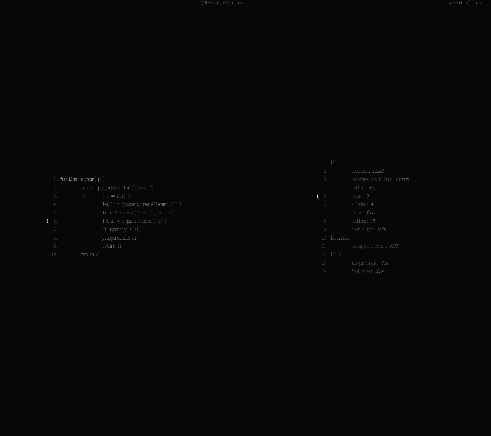

</img>
# Edith  

## DISCLAIMER
the main motive for creating the editor is minimal aesthetics, then ergonomics. 
edith does pretty much everything unconventionally and it lacks in many ways. [we](https://onto.logy.at) use it everyday, but you probably should not.

## concept
edith is a text/code editor that runs on the browser. inspired by the colorforth editor, it uses the *block/screen* concept. a file is broken in screens. text is centered on the screen. every screen has its own cursor. cursor positions are maintained while navigating throught screens (no more cursor hunting). the cursors are not moving between characters but instead between lines. detailed explanation coming soon...

## description
edith code is small and easilly extensible. syntax highlighting is custom and is defined via javascript functions. same with code completion. code completion (not a fan) is not smart but predifined. 

## installation 
edith needs a web server running locally. the server is written in rust. instructions coming soon.
